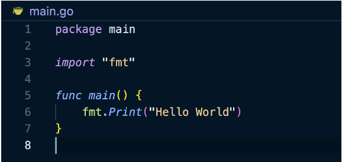

- Create main.go and place code in it
- Must initialize the module with `go mod init <name_of_directory_with_main.go>`
    - `go mod init booking-app`
- All code must belong to a **package**
    - At top of main.go, define keyword "package" and the name of the package that your code will be a part of 
    - Standard name of the main package is "main"
- Must declare an entrypoint for your application
- A function can only have 1 "main" function, because you can only have 1 entrypoint
- Must **import** any functions/libraries you are going to use

- Run `go run main.go` to execute the file

- Variables 
    - Golang variables are mutable (can change) after they are declared
    - Use `var` to declare them
    ```
    var x int = 10
    x = 20 // Allowed
    ```
- Constants 
    - Golang constants cannot be changed once they are declared
    - Use `const` to declare them
    ```
    const pi = 3.14
    pi = 3.14159 // Not allowed
    ```